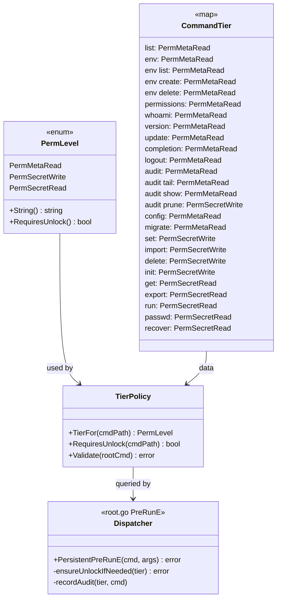
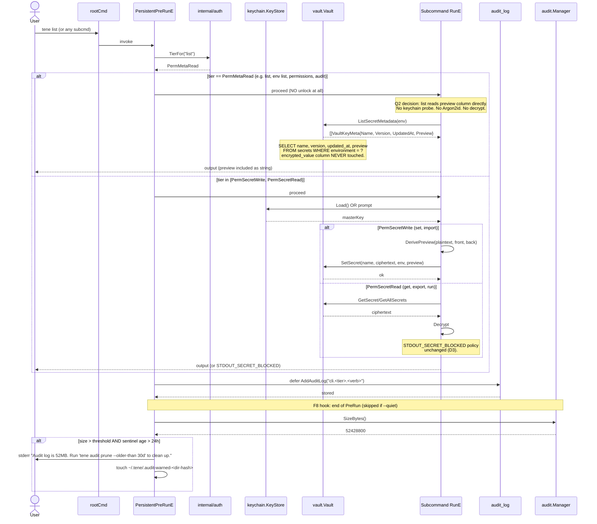
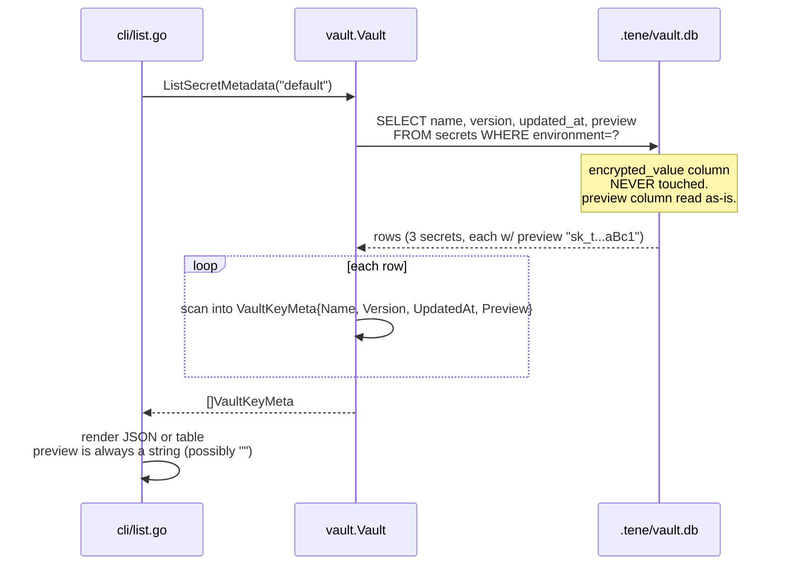
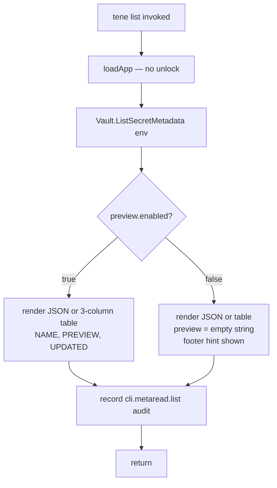
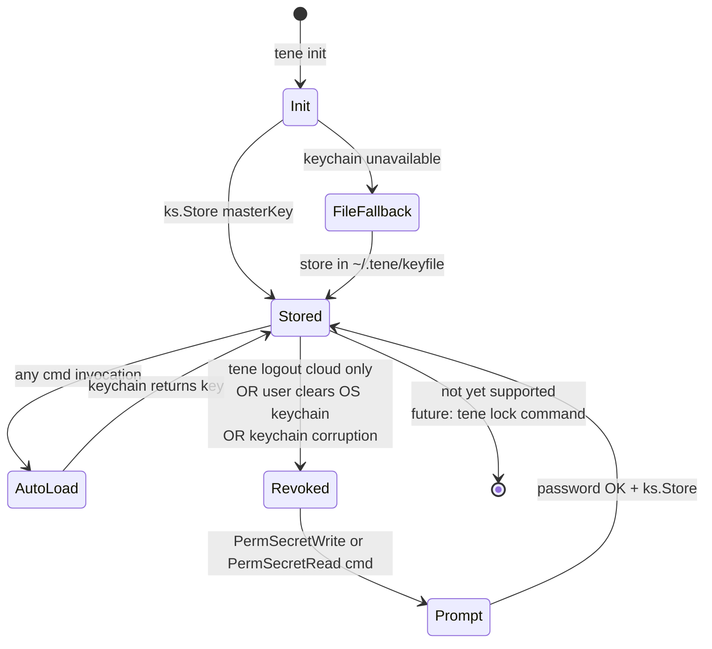
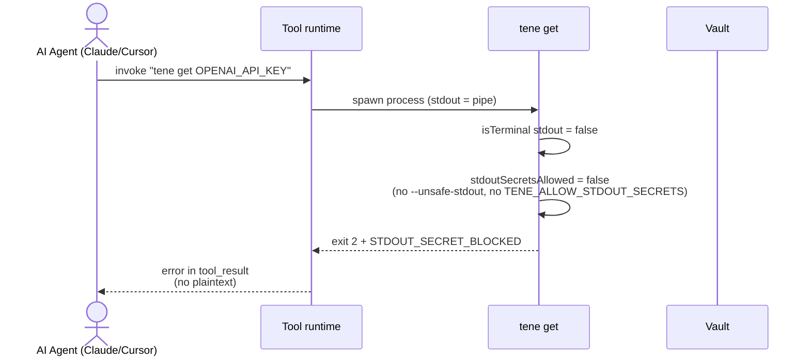
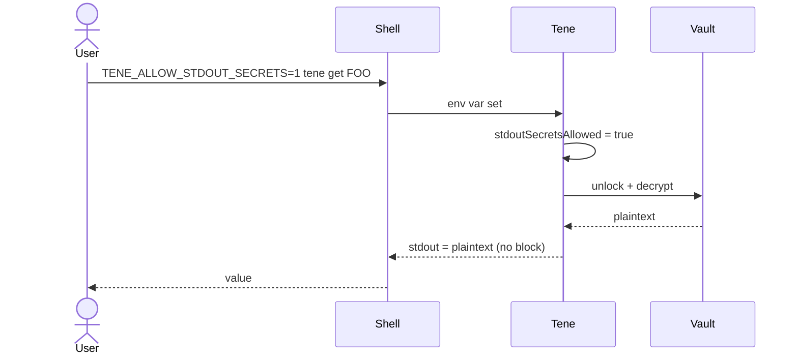
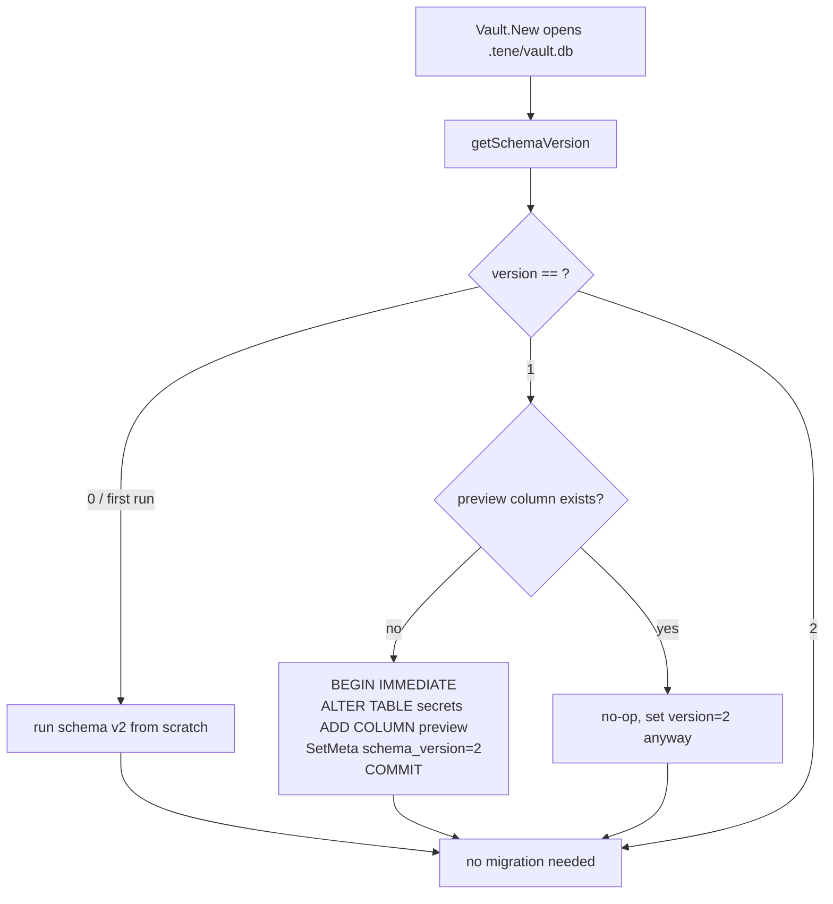
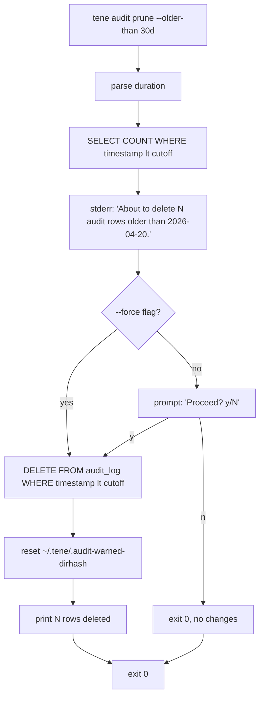
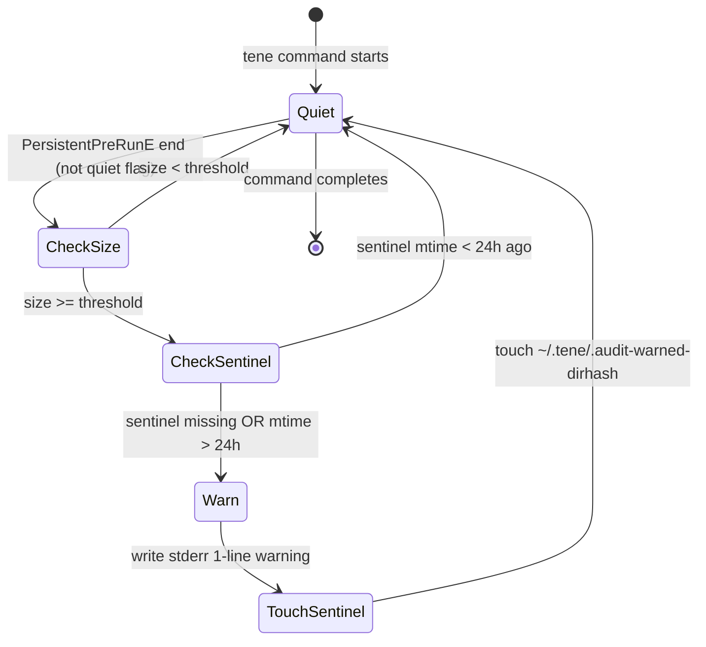

# tene CLI UX & AI-Safe Permission Model — Technical Design

> **Sprint ID**: `cli-ux-permission-model`
> Master Plan reference: [master-plan.md](master-plan.md)
> Plan reference: [plan.md](plan.md)

---

## 0. Foundational Findings from Codebase Analysis + User Decisions

이 design 은 가설이 아니라 실제 코드 읽기 결과 + 사용자의 명시적 결정 기반. 결정적 사실 6가지:

| # | Discovery / Decision | Source | Design impact |
|---|---|---|---|
| **D1** | `secrets.name` 컬럼이 평문 (`name TEXT NOT NULL`) | `internal/vault/schema.go:11` | metadata-only read path 구현 가능. 새 암호화 layer 불필요. |
| **D2** | `go-keyring` 가 macOS Keychain / Linux libsecret / Windows CredManager 를 native 지원. fallback 으로 file-keystore 자동 발동 | `internal/keychain/keychain.go:84-100` | F6 는 작은 UX polish 만 필요. cross-platform 추상화 신규 작업 불요. |
| **D3** | `STDOUT_SECRET_BLOCKED` + `--unsafe-stdout` + `TENE_ALLOW_STDOUT_SECRETS=1` 가 이미 구현됨 | `internal/cli/get.go:34, 114; get_guard_test.go` 전체 | "AI escape hatch" 는 신규 도입이 아닌 **통합·문서화·확장**. 새 `--allow-read` 플래그 도입 안 함. |
| **D4** | `pkg/domain.VaultKeyMeta { Name, Version, UpdatedAt }` 가 이미 존재 (cloud push 용) | `pkg/domain/vault_key_metadata.go:6-10` | F1 에서 same struct 재사용 + `Preview string` 필드 additive 추가. |
| **D5** | `env list`, `env create`, `env delete`, env switch 모두 이미 unlock 없이 동작 (ListEnvironments / CountSecrets 만 호출) | `internal/cli/env.go:94-143; vault.go:298-410` | F2 의 declarative tier 표에서 env 명령들은 PermMetaRead 로 선언만 하면 됨. 실제 코드 변경 0건. |
| **D6 (Q2 User Decision, 2026-05-20 — default 강화 후속 결정 포함)** | 사용자가 보안 trade-off 명시적 수락 — vault DB 에 **preview 평문 컬럼** 신설. **default 는 뒤 4 글자만** (`front=0, back=4`) — API key prefix (sk-, ghp_, AKIA…) 의 service identification 차단. 사용자가 의도적으로 `preview.front>0` 설정 시에만 prefix 일부 노출 (hard cap front+back ≤ 8). opt-out (`preview.enabled=false`) 도 가능. | 사용자 결정 (2회). design rationale: list 가 unlock 여부와 무관하게 partial value 보여주는 UX 가 indie hacker workflow 에 critical. 그러나 prefix 평문 노출 = service identification = 사회공학 공격 가능성 → default 는 뒤 4 만 노출하는 minimum-info 정책. 사용자가 명시적으로 prefix 보고 싶을 때만 opt-in. | F1 reshape: schema v2 migration 필수, `pkg/crypto/preview.go` 신설 (DerivePreview default front=0, back=4), `pkg/domain.VaultKeyMeta` 에 `Preview` 필드, `set`/`import` 시 자동 derive. F3 reshape: unlock 분기 완전 제거, preview 컬럼 그대로 출력. **8번째 feature F8 신설 (Q3 결정)**: audit log 관리 명령. |

### 가설 뒤집힌 부분 (master-plan 의 7-feature 후보 → 8-feature final)

| 가설 (prompt) | 실제 (after read + Q2/Q3) | 결과 |
|---|---|---|
| F4: "Password-Free set + import" — 가능하다고 가정 | `set` 은 encKey 로 암호화 필요. encKey 는 master key 에서 HKDF derive. **회피 불가능**. (`set.go:107-118`) | F4 폐기. 다만 keychain 자동 unlock 으로 사실상 prompt 안 뜸. |
| F5: "AI-Override Flag `--allow-read`" — 신규 도입 | `--unsafe-stdout` + `TENE_ALLOW_STDOUT_SECRETS` 이미 존재. 새 flag 는 중복. | F5 폐기 (escape hatch 항목). F5 자리에 `tene permissions` info command 배치. |
| F6: "Session Token / Keychain Caching" — 신규 설계 | 이미 init 시점에 master key 가 keychain 에 자동 저장됨. session token 개념은 cloud auth 용이지 vault unlock 용 아님. | F6 폐기 (session token 항목). F6 자리에 keychain fallback notice UX polish 배치. |
| F3 (원래): "list no-decrypt mode, preview null on no-unlock" | Q2 decision: preview 컬럼이 vault DB 에 평문 저장. unlock 분기 자체 폐기. | F3 단순화 (코드 LOC -20). F1 무거워짐 (LOC +400, schema migration + preview derive). |
| (sprint 추가): audit log 관리 부재 | Q3 decision: F4 추가만으로는 audit_log 가 무제한 증가 → 운영 부담. `tene audit tail/show/prune` 신설. | **F8 신설** (`tene audit *` + 50MB 임계값 stderr 경고). |

따라서 최종 **8개 feature** 는 처음 가설과 이름은 비슷하지만 **내용이 다르고 더 무거움**. 코드 reality + 사용자 보안 trade-off 의도에 맞춰 reshape.

---

## 1. Permission Tier Model

### 1.1 Conceptual Diagram (Class)



### 1.2 Tier Semantics

| Tier | Definition | Examples | Requires unlock? |
|---|---|---|:--:|
| **PermMetaRead** | Vault metadata (key names, environment names, counts, schema info, preview substring) 만 접근. `encrypted_value` 컬럼 절대 SELECT 안 함. | `list`, `env list/create/delete`, `permissions`, `version`, `whoami`, `update`, `completion`, `logout`, `audit tail/show`, `config`, `migrate` | ❌ |
| **PermSecretWrite** | 새 secret value 를 암호화해서 저장 또는 기존 row 삭제. encKey 필요. | `set`, `import`, `init`, `delete`, `audit prune` | ✅ |
| **PermSecretRead** | 기존 secret value 를 복호화. AI safety policy (STDOUT_SECRET_BLOCKED) 적용. | `get`, `export`, `run`, `passwd`, `recover` | ✅ |

**Note**: `delete` 는 value 복호화 불필요하지만 안전 측면에서 PermSecretWrite. `env delete` 는 metadata 작업이라 PermMetaRead (해당 env 의 secret count 만 표시하고 삭제).

### 1.3 Dispatcher Sequence (Q2 decision applied)



### 1.4 Why Declarative Table (not method-on-cobra)

대안: 각 command 의 `RunE` 가 자기 tier 를 `cobra.Annotations` 로 자체 선언.

**선택**: `internal/auth/CommandTier` 의 단일 map. 이유:
- audit 의 single source of truth — 한 파일에 모든 tier 표
- 새 명령 추가 시 panic-on-missing 으로 등록 강제
- 테스트 작성 쉬움 (map 순회만)
- Cobra annotation 보다 패키지 분리가 깨끗 (CLI ↔ permission 정책 분리)

---

## 2. Vault Metadata Read API (Q2 reshaped)

### 2.1 API Contract

```go
// Package: internal/vault

// ListSecretMetadata returns name+version+updated_at+preview for all secrets in env.
//
// Security invariant: this function MUST NOT read or return the
// encrypted_value column. SQL: SELECT name, version, updated_at, preview FROM secrets.
//
// The preview column is plaintext-stored (Q2 user decision, 2026-05-20).
// It contains a sub-string of the original secret value (front+back chars,
// max 8 combined). When preview.enabled=false config is set, preview is
// stored as empty string for new secrets; existing entries retain their value
// until UpdatePreview is called explicitly.
//
// Returns empty slice (not nil) when env has no secrets.
// Returns error only on DB-level failures (closed connection, malformed schema).
func (v *Vault) ListSecretMetadata(env string) ([]domain.VaultKeyMeta, error)

// UpdateSecretPreview sets the preview column for a single secret.
// Used by `tene migrate fill-previews` and (atomically) by SetSecret.
func (v *Vault) UpdateSecretPreview(name, env, preview string) error

// BackfillPreviews iterates all secrets in env with empty preview and
// derives + stores the preview from the decrypted plaintext.
// derive callback receives (plaintext, name) and returns (preview, error).
// Returns the number of secrets updated.
func (v *Vault) BackfillPreviews(env string, derive func(plaintext, name string) (string, error)) (int, error)
```

### 2.2 Data Flow (no-decrypt path, Q2 — preview column read directly)



### 2.3 Domain Type (additive change — Q2 added Preview field)

**Before**:
```go
type VaultKeyMeta struct {
    Name      string    `json:"name"`
    Version   int       `json:"version"`
    UpdatedAt time.Time `json:"updated_at"`
}
```

**After (Q2)**:
```go
type VaultKeyMeta struct {
    Name      string    `json:"name"`
    Version   int       `json:"version"`
    UpdatedAt time.Time `json:"updated_at"`
    Preview   string    `json:"preview"`           // NEW (Q2): plaintext sub-string. **always emit** (no omitempty). Empty string `""` when `preview.enabled=false` or pre-migration v1 vault. Honors Q2 "always-string" contract — cloud server unmarshalers must treat `""` as "no preview".
}
```

→ `pkg/domain` 변경 = **1 line, additive only**. JSON tag: **`omitempty` 사용 안 함** (2026-05-20 결정 — Q2 "always-string" 계약). `preview` 키가 list 출력 + cloud push payload 모두에서 항상 emit. Empty 상태 (`preview.enabled=false` 또는 v1 vault) 는 `"preview": ""` 로 표현 (PRD NFR-03, design §8.5 D-1, design §10.2).

→ tene-cloud 가 이 필드를 어떻게 다루는지 pre-flight grep 으로 확인 필수 (§8.4).

---

## 3. `list` Reads Preview Column Directly (Q2 reshaped)

### 3.1 Decision Logic (단순화)

Q2 decision 으로 unlock 분기 자체가 폐기됨. flowchart 가 거의 일자형:



`tryLoadMasterKeyNoPrompt` helper 는 더 이상 list 에서 호출 안 함 (Q2 단순화). 다른 PermMetaRead 명령이 필요로 하면 유지 가능 — 그러나 sprint scope 내에서는 list 는 결정적으로 unlock 없이 진행.

### 3.2 JSON Shape (Q2 결정 — preview 항상 string)

**Before sprint** (current):
```json
{
  "ok": true,
  "project": "demo",
  "environment": "default",
  "secrets": [
    { "name": "STRIPE_KEY", "preview": "sk_te*****", "version": 1, "updatedAt": "2026-05-20T..." }
  ],
  "count": 1
}
```

**After sprint** (Q2 — preview always string):
```json
{
  "ok": true,
  "project": "demo",
  "environment": "default",
  "secrets": [
    { "name": "STRIPE_KEY", "preview": "sk_t…aBc1", "version": 1, "updatedAt": "2026-05-20T..." }
  ],
  "count": 1
}
```

**After sprint** (preview.enabled=false OR legacy v1 vault before fill-previews):
```json
{
  "ok": true,
  "project": "demo",
  "environment": "default",
  "secrets": [
    { "name": "STRIPE_KEY", "preview": "", "version": 1, "updatedAt": "2026-05-20T..." }
  ],
  "count": 1
}
```

**Diff**:
- ❌ NO new `unlocked` field (Q2 단순화 — list 는 unlock 개념과 무관)
- 🔄 `preview` 변환: `"sk_te*****"` → `"sk_t…aBc1"` (front+back 노출 형식, ellipsis 중간). 단축 형식. **CHANGELOG `### Changed` 필수**.
- 🔄 `preview` type 안정성: **항상 string**. null 또는 absent 절대 없음.
- All other keys unchanged.

### 3.3 Text Output

**Default (preview.enabled=true, preview filled)**:
```
  Project: demo (default)

  NAME                           PREVIEW          UPDATED
  STRIPE_KEY                     sk_t…aBc1        2 hours ago

  1 secrets in "default" environment
```

**preview.enabled=false**:
```
  Project: demo (default)

  NAME                           PREVIEW          UPDATED
  STRIPE_KEY                     -                2 hours ago

  1 secrets in "default" environment
  Note: previews disabled. Run `tene config preview.enabled=true` to re-enable.
```

**Legacy v1 vault, migrate 완료, fill-previews 미실행**:
```
  Project: demo (default)

  NAME                           PREVIEW          UPDATED
  STRIPE_KEY                     -                2 hours ago

  1 secrets in "default" environment
  Note: previews are empty. Run `tene migrate fill-previews` (one-time, requires password).
```

### 3.4 No tryLoadMasterKeyNoPrompt Helper Needed (Q2 단순화)

이전 design 의 `tryLoadMasterKeyNoPrompt` helper 는 Q2 decision 으로 **불필요해짐**. list 는 vault unlock 분기 자체가 사라졌고, preview 는 DB 컬럼에서 직접 옴.

→ helper 도입 안 함. `root.go` LOC 추가 0건 (이 부분).

만약 future 에 다른 PermMetaRead 명령이 keychain-only unlock 이 필요해지면 그때 도입.

---

## 4. Keychain Caching State Machine

### 4.1 Lifecycle



### 4.2 Current State (no change in this sprint)

- **Init**: `ks.Store(masterKey)` 호출. macOS: Keychain Access. Linux: libsecret. Windows: CredManager. Fallback: `~/.tene/keyfile`.
- **AutoLoad**: 매 명령마다 `loadOrPromptMasterKey` (또는 새 `tryLoadMasterKeyNoPrompt`) 가 `ks.Load()` 시도.
- **Revoke**: 사용자가 직접 OS keychain 에서 entry 삭제, 또는 keychain 손상.
- **Re-store**: revoke 후 prompt 성공하면 다시 ks.Store 호출되는지? — **현재 코드는 호출하지 않음**. (helpers.go 의 `loadOrPromptMasterKey` 가 prompt 후 store 안 함.) Future improvement 후보지만 이 sprint scope 아님.

### 4.3 F6 — Fallback Notice (this sprint)

새 동작: file-keystore fallback 발동 시 첫 호출에서 stderr notice:

```
Note: using file-based keystore at ~/.tene/keyfile
      (OS keychain unavailable). This notice shows once.
      To suppress entirely: tene <cmd> --quiet
```

Sentinel: `~/.tene/.fallback-warned-<dir-hash>`. 다음 명령부터 silent.

---

## 5. AI Safety Escape Hatch (Status: Already Implemented)

### 5.1 Current Mechanism (D3 finding)

이미 구현됨. 이 sprint 에서 변경 없음. 다만 design.md 에 명문화:



User-explicit opt-in:


### 5.2 Why NO New `--allow-read` Flag

Prompt 가 제안한 새 `--allow-read` 플래그는:
- `--unsafe-stdout` 와 의미 중복 (둘 다 "AI가 값 읽는 것을 허용")
- 새 권한 표면 도입 — security review 부담
- 기존 `get_guard_test.go` 의 4 케이스 (NonTTY_BlocksByDefault, EnvOverride_Allows, UnsafeFlag_Allows, JSON_AllowsButWarns) 이 이미 모든 시나리오 커버

**결정**: 새 플래그 도입 안 함. F5 에서 `--unsafe-stdout` 정책을 README + `tene permissions` 출력에 명시.

### 5.3 Audit Trail for Secret Reads

`tene get` 호출 시 audit log 에 기록되는 정보:

| 필드 | 값 |
|---|---|
| action | `secret.read` (기존, 보존) + `cli.secretread.get` (신규, F4) |
| resource_name | key name |
| details | "" (값 자체는 절대 기록 안 함) |
| timestamp | UTC |

opt-in 으로 plaintext stdout 출력된 경우에도 audit 에 그 사실은 별도 기록 안 함 (opt-in 자체가 의지 표명).

---

## 6. Database Schema — v1 → v2 Migration (Q2 reshaped)

### 6.1 Schema v2 (Q2 — preview column added)

v1 → v2 schema diff:
```sql
-- v1 (current)
CREATE TABLE secrets (
    id              INTEGER PRIMARY KEY AUTOINCREMENT,
    name            TEXT    NOT NULL,
    encrypted_value TEXT    NOT NULL,
    environment     TEXT    NOT NULL DEFAULT 'default',
    version         INTEGER NOT NULL DEFAULT 1,
    created_at      TEXT    NOT NULL DEFAULT (datetime('now')),
    updated_at      TEXT    NOT NULL DEFAULT (datetime('now')),
    UNIQUE(name, environment)
);

-- v2 migration (idempotent)
ALTER TABLE secrets ADD COLUMN preview TEXT NOT NULL DEFAULT '';
-- vault_meta: schema_version = 2
```

기존 column 무변경. 새 `preview` 컬럼만 추가. 기본값 빈 문자열 — 기존 row 의 preview 는 모두 `""` 가 됨, 사용자가 `tene migrate fill-previews` 또는 다음 `tene set` 으로 채움.

### 6.2 Migration Trigger Options

3가지 trigger 시나리오:

| 시나리오 | Trigger | Preview 채우기 |
|---|---|---|
| **신규 사용자 (`tene init`)** | v2 schema 로 처음 생성 | 즉시 첫 `tene set` 부터 preview 자동 derive |
| **기존 사용자, 첫 명령** | `Vault.New()` 호출 시 `migrate()` 가 자동 ALTER TABLE | 기존 secret 의 preview = `""`. footer hint 로 `tene migrate fill-previews` 권고 |
| **기존 사용자, 명시 명령** | `tene migrate fill-previews` (사용자 의도) | 모든 secret 의 preview 를 한 번에 채움. 1회 unlock 필요 |

자동 채우기는 안 함 — 사용자 unlock 권한 필요한 작업을 silent 하게 하지 않음.

### 6.3 Migration Algorithm (idempotent)



`PRAGMA table_info("secrets")` 로 컬럼 존재 확인 → 이미 있으면 ALTER skip. `BEGIN IMMEDIATE` 로 write lock 획득 (다른 process 가 동시 migrate 시도 시 lock wait 또는 fail-fast).

**Concurrency (2026-05-20 honest amendment, F8' compensation):** we rely on
SQLite's default deferred-write transaction locking. The PRAGMA `table_info`
idempotency check inside the transaction ensures that even if two processes
race to upgrade, the second one sees the column already present and skips
the ALTER. The driver in use (modernc.org/sqlite) does not currently
expose an in-driver `BEGIN IMMEDIATE` — issuing the statement inside an
already-open `db.Begin()` transaction returns "cannot start a transaction
within a transaction"; we documented this in `internal/vault/migration.go`
lines 117-135 and continue rather than fail. `TestMigrate_ConcurrentOpens`
validates safety end-to-end. The flowchart node `BEGIN IMMEDIATE` above
remains a conceptually accurate description of the desired isolation
level; the runtime achieves the same guarantee through driver-default
coarse locking plus the PRAGMA idempotency check.

### 6.4 derivePreview Pseudocode

```go
// pkg/crypto/preview.go
func DerivePreview(plaintext string, front, back int) string {
    if front < 0 || back < 0 || front+back > 8 {
        // hard cap — never exceed 8 chars total
        return "*****"
    }
    if front == 0 && back == 0 {
        return ""  // user explicitly disabled
    }
    if len(plaintext) < front+back+1 {
        // value too short to mask safely
        return "*****"
    }
    // unicode-safe: use runes, not bytes
    r := []rune(plaintext)
    return string(r[:front]) + "…" + string(r[len(r)-back:])
}
```

예시 (**default `front=0, back=4`** — prefix 노출 차단):
- `"sk-proj-1234567890aBcD"` → `"…aBcD"` (sk- prefix 숨김 → OpenAI/Stripe 식별 불가)
- `"ghp_abc123def456ghi789"` → `"…i789"` (ghp_ prefix 숨김 → GitHub 식별 불가)
- `"hello"` (len 5) → `"…ello"` (front=0, back=4 라 len ≥ 5 면 OK)
- `"abc"` (len 3) → `"*****"` (front+back+1 > len)
- `""` → `"*****"`

opt-in 예시 (`tene config preview.front=4` 후, 즉 front=4, back=4):
- `"sk-proj-1234567890aBcD"` → `"sk-p…aBcD"` (사용자가 prefix 보고 싶다고 명시적으로 동의)
- `"abcde"` (len 5, front=2, back=2) → `"ab…de"`

hard cap: front + back ≤ 8, front ∈ [0,8], back ∈ [0,8].

### 6.5 Rollback Procedure

만약 schema v2 가 문제를 일으키면:

1. 사용자가 backup 보유 시: `cp .tene/vault.db.backup .tene/vault.db` (간단)
2. backup 없을 때:
   ```sql
   BEGIN;
   CREATE TABLE secrets_v1 AS SELECT id, name, encrypted_value, environment, version, created_at, updated_at FROM secrets;
   DROP TABLE secrets;
   ALTER TABLE secrets_v1 RENAME TO secrets;
   -- vault_meta: schema_version = 1
   COMMIT;
   ```
3. 이 절차는 `tene migrate rollback-v1` 명령으로 제공? — **이번 sprint scope 외**. 수동 SQL 안내만 SECURITY.md 에 명문화.

### 6.6 Why Not Encrypt Preview?

대안: preview 도 암호화해서 컬럼에 저장.
- 장점: vault.db 유출 시에도 추가 노출 없음
- 단점: list 가 다시 unlock 필요 → Q2 의 본래 목적 (password fatigue 제거) 무너짐

→ Q2 user decision: **명시적 trade-off 수락**. preview = 평문, opt-out 옵션 제공으로 mitigation.

---

## 6A. Preview Privacy Controls (Q2 신설)

### 6A.1 Config Keys

| Key | Type | Default | Range | Effect |
|---|---|---|---|---|
| `preview.enabled` | bool | `true` | true / false | false 시 `set`/`import` 가 preview = `""` 저장. 기존 entry 는 그대로 (UpdateSecretPreview 명시 호출만 변경). |
| `preview.front` | int | **`0`** | 0-8 | value 앞쪽 노출 글자 수. **default 0** — API key prefix (sk-, ghp_, AKIA) 의 service identification 차단. 사용자가 prefix 도 보고 싶으면 opt-in. |
| `preview.back` | int | `4` | 0-8 | value 뒤쪽 노출 글자 수. 충돌 확률 ≈ 0 (62^4 ≈ 1500만분의 1). |
| `audit.warnAtMB` | int | `50` | 1-1000 | F8 — audit log 임계값 (MB) |

config 저장 위치: `vault_meta` 테이블 (key prefix `config.`). 새 테이블 신설 안 함.

Validation:
- `preview.front + preview.back > 8` → 에러 (hard cap)
- `preview.front < 0` 또는 `> 8` → 에러
- `audit.warnAtMB < 1` → 에러

### 6A.2 Preview Off — list 출력 형태

`tene config preview.enabled=false` 후 list:

JSON:
```json
{
  "ok": true,
  "secrets": [
    { "name": "STRIPE_KEY", "preview": "", "version": 1, "updatedAt": "..." }
  ]
}
```

Text:
```
  NAME                           PREVIEW          UPDATED
  STRIPE_KEY                     -                2 hours ago

  Note: previews disabled. Run `tene config preview.enabled=true` to re-enable.
```

이는 prompt 의 "Q2 option C 형태 (name + env + len + created)" 와 의도 일치 — 다만 sprint 에서는 `len` (value 길이) 표시는 안 함 (additional info leak), `env` 는 `tene list` 가 env-scoped 라 자명. **PREVIEW 컬럼만 `-` 으로 비움**.

### 6A.3 Discoverability

`tene config --help` 출력 첫 섹션을 **Privacy** 로:
```
Privacy:
  preview.enabled       Show partial value previews in `tene list` (default: true)
  preview.front         Chars exposed from start (default: 0 — prefix hidden; max 8 total)
  preview.back          Chars exposed from end (default: 4; max 8 total)

Audit:
  audit.warnAtMB        Warn when audit_log exceeds this size (default: 50)
```

`tene init` 출력에 1줄 안내 — F7 에서 처리.

---

## 6B. Audit Log Management (F8 — Q3 신설)

### 6B.1 Subcommand Surface

```
tene audit                              # alias to "tail -n 20"
tene audit tail [-n N]                  # last N entries
tene audit show --since DURATION --filter GLOB --resource NAME
tene audit prune --older-than DURATION [--force]
```

All `tene audit *` 는 PermMetaRead tier — unlock 불요.

### 6B.2 Log Format (text mode)

```
2026-05-20 14:23:01  cli.metaread.list           default
2026-05-20 14:23:15  cli.secretwrite.set         STRIPE_KEY
2026-05-20 14:23:15  secret.write                STRIPE_KEY      (legacy entry, preserved)
2026-05-20 14:24:08  cli.secretread.get          STRIPE_KEY
2026-05-20 14:24:08  secret.read                 STRIPE_KEY      (legacy entry, preserved)
```

`--json` 모드는 NDJSON (1 line per entry):
```json
{"ts":"2026-05-20T14:23:01Z","action":"cli.metaread.list","resource":"default","details":""}
{"ts":"2026-05-20T14:23:15Z","action":"cli.secretwrite.set","resource":"STRIPE_KEY","details":""}
```

NDJSON 선택 이유: append-only stream 친화, `jq -c` / `grep` 단순.

### 6B.3 `tene audit prune` Flow



핵심 invariant:
- `--force` 없이 절대 silent delete 금지
- prune 후 sentinel 리셋 → 다음 임계값 초과 시 다시 경고
- 자동 정리/스케줄 없음 — forensic 보존이 우선

### 6B.4 Threshold Warning — State Machine



- Sentinel path: `~/.tene/.audit-warned-<hex(sha256(projectDir)[:8])>`
- 24h window: `time.Since(stat.ModTime()) > 24*time.Hour`
- `--quiet` flag: skip entire check
- `audit.warnAtMB` config override: applies to threshold value

### 6B.5 Sizing — `Manager.SizeBytes()`

쉬운 추정 (rough byte estimate):
```sql
SELECT
  SUM(
    length(COALESCE(action, '')) +
    length(COALESCE(resource_name, '')) +
    length(COALESCE(details, '')) +
    32  -- timestamp + id + overhead
  )
FROM audit_log
```

정확도: ±20%. SQLite 의 page 단위 정확 sizing 대신 빠른 추정 우선.

### 6B.6 audit_log 스키마 (no change)

```sql
-- 기존 v1 schema 와 동일, v2 migration 에서 무변경
CREATE TABLE IF NOT EXISTS audit_log (
    id            INTEGER PRIMARY KEY AUTOINCREMENT,
    action        TEXT NOT NULL,
    resource_name TEXT,
    details       TEXT,
    timestamp     TEXT NOT NULL DEFAULT (datetime('now'))
);
CREATE INDEX IF NOT EXISTS idx_audit_timestamp ON audit_log(timestamp);
```

F8 은 새 컬럼 추가 안 함 — 기존 스키마로 충분.

---

## 7. API Contracts Summary (Q2 + F8 reshaped)

### 7.1 New Public APIs

```go
// Package: internal/vault
func (v *Vault) ListSecretMetadata(env string) ([]domain.VaultKeyMeta, error)
func (v *Vault) UpdateSecretPreview(name, env, preview string) error
func (v *Vault) BackfillPreviews(env string, derive func(plaintext, name string) (string, error)) (int, error)
func (v *Vault) GetAuditLogSize() (int64, error)
func (v *Vault) QueryAuditLog(filter AuditFilter) ([]AuditEntry, error)
func (v *Vault) PruneAuditLog(before time.Time) (deleted int64, err error)

// Package: internal/auth (new)
type PermLevel int
const (
    PermMetaRead PermLevel = iota
    PermSecretWrite
    PermSecretRead
)
func (p PermLevel) String() string
func (p PermLevel) RequiresUnlock() bool
func TierFor(cmdPath string) (PermLevel, bool)
func Validate(rootCmd *cobra.Command) error

// Package: internal/audit (new, F8)
type Manager struct { ... }
type LogEntry struct { Timestamp time.Time; Action, Resource, Details string }
type Filter struct { Since, Until time.Time; ActionGlob, Resource string }
func New(v *vault.Vault) *Manager
func (m *Manager) Tail(n int) ([]LogEntry, error)
func (m *Manager) Show(f Filter) ([]LogEntry, error)
func (m *Manager) SizeBytes() (int64, error)
func (m *Manager) Prune(olderThan time.Duration) (deleted int64, err error)

// Package: internal/keychain (additive)
type FallbackInfo struct {
    Used   bool
    Reason string
    Path   string
}
func NewStoreWithStatus(projectPath string) (KeyStore, FallbackInfo)

// Package: internal/config (extended)
func Get(key string) (string, error)         // e.g. "preview.enabled", "audit.warnAtMB"
func Set(v *vault.Vault, key, value string) error
func PreviewEnabled(v *vault.Vault) bool
func PreviewFront(v *vault.Vault) int
func PreviewBack(v *vault.Vault) int
func AuditWarnAtMB(v *vault.Vault) int

// Package: pkg/crypto (new file: preview.go)
func DerivePreview(plaintext string, front, back int) string
```

### 7.2 Modified APIs

| Function | Change |
|---|---|
| `cli/list.runList` | 흐름 재작성, unlock 분기 제거. JSON: `preview` 항상 string. |
| `cli/set.runSet` | encKey 로 암호화 직후 preview derive + atomic store |
| `cli/import.runImport` | 동일 — batch 안에서 derive |
| `cli/init.runInit` | 출력 텍스트 2-3줄 추가 (permission + preview) |
| `cli.rootCmd` | `PersistentPreRunE` hook 추가 (tier check + audit + F8 threshold warning) |
| `vault.Vault.New` | `migrate()` 가 v1 → v2 schema bump 처리 (ALTER TABLE) |
| `vault.Vault.SetSecret` | preview 인자 추가 — atomic INSERT with ciphertext + preview |
| `pkg/domain.VaultKeyMeta` | `Preview string` 필드 additive |

### 7.3 Unchanged APIs (verified)

- `cli/get.runGet` — STDOUT_SECRET_BLOCKED 정책 그대로
- `cli/run.runRun` — env injection 그대로
- `cli/export.runExport` — bulk decrypt 그대로
- `cli/env.run*` — 동일 (이미 password-free)
- `pkg/crypto/encrypt.go`, `decrypt.go`, `kdf.go` — 0 변경 (Argon2id 파라미터 무변경)
- `internal/recovery/*` — 0 변경
- `pkg/domain/vault.go` (User/Team) — 0 변경

---

## 8. Cross-Repo Impact Analysis (Q2 + F8 reshaped)

### 8.1 tene (this repo)

| Path | Change | Risk |
|---|---|---|
| `internal/vault/vault.go` | +ListSecretMetadata, +UpdateSecretPreview, +BackfillPreviews, +GetAuditLogSize, +QueryAuditLog, +PruneAuditLog, modified SetSecret | med (큰 surface) |
| `internal/vault/schema.go` | schema v2 migration SQL + `currentSchemaVersion=2` | **high (DB compatibility)** |
| `internal/auth/*` | new package | low |
| `internal/audit/*` | new package (F8) | low |
| `internal/config/*` | new keys (preview.*, audit.*) | low |
| `internal/cli/root.go` | PersistentPreRunE + F8 threshold hook | med (cobra interaction) |
| `internal/cli/list.go` | flow rewrite, unlock 분기 제거 | med (JSON shape) |
| `internal/cli/set.go`, `import_cmd.go` | preview derive + store | med |
| `internal/cli/permissions.go` | new file | low |
| `internal/cli/audit.go` | new file (F8) | low |
| `internal/cli/migrate.go` | new file (F1) | low |
| `internal/cli/config.go` | new file (F1, preview/audit 설정) | low |
| `internal/cli/init.go` | output text +2-3 lines | trivial |
| `internal/keychain/keychain.go` | +NewStoreWithStatus | low |
| `pkg/domain/vault_key_metadata.go` | +1 field `Preview string` (additive) | **med — cross-repo** |
| `pkg/crypto/preview.go` | new file (Q2) | low |
| `pkg/crypto/*` 기존 파일 | 0 변경 | nil |
| `cmd/tene/main.go` | 0 change | nil |

### 8.2 tene-cloud (sibling repo) — Q2 영향 재검증

| Path | Change | Verification |
|---|---|---|
| `go build ./...` | should remain green after `VaultKeyMeta.Preview` 추가 | F1 머지 직후 |
| `go test ./...` | should remain green | F1 머지 직후 |
| pkg dependency on `pkg/domain.VaultKeyMeta` | additive (`Preview string` 새 필드) | `grep -rn "VaultKeyMeta" /Users/popup-kay/Documents/GitHub/agentkay/tene-cloud/` |
| sync push payload | `Preview` 필드 자연스럽게 흘러감 | **결정 필요**: cloud server 가 preview 를 저장할지 무시할지. 기본 권장 = **무시** (server-side는 ciphertext only). server 가 preview 받아 DB 저장하면 dashboard 노출 → 별도 sync 정책 결정 |
| Dashboard UI | 0 change | N/A |
| `secrets` table schema on cloud side | 0 change (cloud has own schema, not shared) | N/A — vault.db migration 은 client-side only |

### 8.3 tene apps/web (landing)

- 0 change. Optional: blog post 별도 PDCA (out of this sprint).
- Consider: "Permission tiers + preview trade-off" 블로그가 release 시점에 1편 — separate PDCA.

### 8.4 Pre-flight Commands (before F1 starts)

```bash
# 1. Verify VaultKeyMeta + secrets schema usage in tene-cloud
grep -rn "VaultKeyMeta" /Users/popup-kay/Documents/GitHub/agentkay/tene-cloud/
grep -rn "encrypted_value\|\"secrets\"" /Users/popup-kay/Documents/GitHub/agentkay/tene-cloud/

# 2. Verify domain package import surface
grep -rn "pkg/domain" /Users/popup-kay/Documents/GitHub/agentkay/tene-cloud/

# 3. Establish tene-cloud baseline green build
cd /Users/popup-kay/Documents/GitHub/agentkay/tene-cloud/ && go build ./... && go test ./...

# 4. Q2 specific — confirm sync protocol does not require schema versioning
grep -rn "schema_version" /Users/popup-kay/Documents/GitHub/agentkay/tene-cloud/
```

이 4개 결과를 plan.md F1 작업 시작 시점에 attach.

### 8.5 Cross-Repo Decision Points (Q2)

- **D-1**: cloud server 가 client 의 schema_version 정보를 받아 처리하는가? — 현재 sync 가 비활성이므로 **NO**. 활성화 시 server 는 `Preview string` 필드의 빈 문자열 `""` 을 "no preview" 의미로 처리 (=v1 client 또는 `preview.enabled=false`). **`omitempty` 사용 안 함** (2026-05-20 결정) — Q2 "always-string" 계약 준수가 우선. 모든 JSON output 에 `"preview"` 키가 무조건 존재 (값은 `""` 또는 partial string). 이는 list 출력 + cloud push payload 모두 동일 정책.
- **D-2**: cloud server 가 preview 필드를 DB 에 저장하면 dashboard 에서 partial value 가 보임 — **별도 product 결정**. 이 sprint 에서는 server 변경 0건, 즉 받아서 무시.
- **D-3**: 기존 cloud 에 push 된 vault 가 client 로 pull 될 때 preview 비어있음. `tene migrate fill-previews` 로 client-side 채우면 OK.

---

## 9. Error & Edge Cases (Q2 + F8 reshaped)

| Case | Behavior |
|---|---|
| vault.db 없음 + `tene list` | `ErrVaultNotFound` (기존 동작) — tier 검증 전 단계에서 fail |
| `tene list` + legacy v1 vault (auto-migrated, fill-previews 미실행) | metadata 표시, preview = `""`, footer 에 fill-previews 권고 |
| `tene list --env nonexistent` | 빈 secrets array (현재 동작 유지) |
| `tene list` + `preview.enabled=false` | preview = `""` for all rows, footer 에 config hint |
| `tene set X Y` + keychain 손상 | password prompt (기존 흐름) + preview 자동 derive 후 atomic store |
| `tene set X Y` + non-TTY + no env var | `ErrInteractiveRequired` (기존) |
| `tene set X Y` + value 너무 짧음 (front+back+1 미만) | preview = `"*****"` (safe fallback) |
| `tene get FOO` + 잘못된 키 이름 | `ErrSecretNotFound` (기존) |
| `tene get FOO` + non-TTY + no opt-in | `STDOUT_SECRET_BLOCKED` (기존, 무변경) |
| 새 명령 추가했는데 CommandTier 에 등록 안 함 | PersistentPreRunE 가 panic → 테스트 단계에서 즉시 발견 |
| `tene permissions` + corrupted vault | 그래도 동작 (DB 안 읽고 정적 표만 출력) |
| `tene migrate fill-previews` + 이미 모두 채워짐 | "0 secrets updated" 메시지, 성공 exit 0 |
| `tene config preview.front=10` (out of range) | error, exit 2, "value must be 0-8" |
| `tene config preview.front=5 preview.back=5` (합 10) | error, exit 2, "front + back must be ≤ 8" |
| `tene audit prune --older-than 30d` 사용자 confirm `n` | exit 0, "Cancelled. No changes." |
| `tene audit prune` + 0 matching rows | "0 rows to prune." exit 0 |
| Audit threshold warning + `--quiet` | suppress entirely (no sentinel write) |
| Concurrent `tene` processes + schema migration | `BEGIN IMMEDIATE` → 한쪽 wait, 다른쪽 진행. 양쪽 다 v2 결과 도달 |

---

## 10. Security Invariants Summary (Q2/F8 — design 측면 명문화)

> **총 14개 invariant.** `master-plan.md §8` 의 I-1 ~ I-14 ID 와 1:1 매핑. `state JSON securityInvariants[]` 14 entries 와도 동기화.

### 10.1 Primary Invariants (14)

**Existing (I-1 ~ I-8)**:

1. **I-1 — Encrypted values column 평문화 금지** — `secrets.encrypted_value` 는 항상 ciphertext (XChaCha20-Poly1305 + AEAD).
2. **I-2 — Decrypt 호출 전 unlock 검증** — `crypto.Decrypt` 호출 전 `loadOrPromptMasterKey` 또는 keychain 검증.
3. **I-3 — STDOUT_SECRET_BLOCKED 정책 무변경** — `tene get` / `export` / `run` 의 AI safety 정책 그대로.
4. **I-4 — 외부 네트워크 호출 0 추가** — zero-server 원칙 유지.
5. **I-5 — AI default 차단** — secret VALUE 전체를 stdout 으로 받는 default 동작 0건 (--unsafe-stdout / TENE_ALLOW_STDOUT_SECRETS=1 이외 경로 없음).
6. **I-6 — Argon2id 파라미터 무변경** — `time=3, memory=64MB`.
7. **I-7 — Recovery key flow 무변경** — `internal/recovery/` 안 건드림.
8. **I-8 — Keychain service name 무변경** — `ServiceName = "tene"` + project hash.

**NEW Q2 (I-9 ~ I-13)** — preview 평문 컬럼 trade-off:

9. **I-9 — Preview 컬럼 sub-string 한정** — front + back ≤ 8 chars 합산 hard cap. `pkg/crypto.DerivePreview` 에서 enforce. **Default: front=0, back=4** (prefix 노출 차단).
10. **I-10 — preview.enabled=false 시 빈 문자열** — preview 컬럼 NOT NULL DEFAULT ''. opt-out 사용자는 항상 `""` 저장.
11. **I-11 — tene init 안내 + 거부 옵션** — init 출력 3 line hint 에 preview 동작 명시 + `tene config preview.enabled=false` 안내.
12. **I-12 — vault.db 파일 권한 0600** — 이미 `vault.New` 에서 chmod, 회귀 가드.
13. **I-13 — SECURITY.md threat model 명문화** — preview 평문 컬럼이 어떤 위협을 추가하는지 + default front=0 으로 service identification 차단된다는 점 + opt-in 시 trade-off 매트릭스.

**NEW F8 (I-14)** — audit log forensic 보존:

14. **I-14 — Audit log 자동 삭제 금지** — `tene audit prune` 명시적 confirm 만. G10 gate 로 enforce (`grep -rn "DELETE FROM audit_log" internal/` ≤ 1 — manager 내 단일 정의 외 0건).

### 10.2 Supplementary Design Enforcements (non-invariant guard rails)

이 sprint 의 design 단계에서 추가로 enforced 되는 정책 (invariant 카운트 외):

- **Schema migration idempotent + transactional** — `BEGIN IMMEDIATE` + `PRAGMA table_info` 체크 (G8 gate).
- **Cross-repo additive only** — `pkg/domain.VaultKeyMeta` 변경은 신규 필드만, 기존 필드 제거/이름 변경 금지 (G3 gate).
- **JSON `preview` 키 always-string** — `omitempty` 사용 금지. Empty 상태에서도 `"preview": ""` emit. design.md §2.3 + plan.md F1 step 5.

---

## 11. Open Design Questions — RESOLVED (2026-05-20)

원래 Q1-Q5 모두 사용자가 답변 완료. 기록 보존용:

| Q | Decision | Implementation |
|---|---|---|
| **Q1**: `tene permissions` 명령 이름 OK? | ✅ 채택 | F5 그대로 |
| **Q2**: JSON `preview` null vs absent vs always-string? | ⚠️ 명시적 보안 trade-off 수락 — preview 평문 컬럼 신설. JSON 은 항상 string. | F1 reshape (schema v2 migration), F3 reshape (preview 컬럼 직접 read), `tene config preview.*` 신설, SECURITY.md 명문화 |
| **Q3**: audit log 2배 증가 부담? | ✅ 수락 + **F8 신설** | `tene audit tail/show/prune` + 50MB 임계값 경고 |
| **Q4**: `tene init` 출력 hint 한 줄 vs 전체 표? | ✅ A 채택 (hint 한 줄) | F7 — permission + preview 2-3줄 추가 |
| **Q5**: list 텍스트 출력 컬럼 (이전 design 의 sub-question) | Q2 결정으로 무의미 — preview 가 항상 있어서 3컬럼 `NAME | PREVIEW | UPDATED` 고정 | F3 — 항상 3컬럼, preview 비었을 때 `-` |

추가 open question 없음. 모두 결정됨.

---

## 12. References

- `internal/vault/schema.go` — SQL schema (D1, F1 에서 v2 migration 추가)
- `internal/keychain/keychain.go` — go-keyring usage (D2)
- `internal/cli/get.go` lines 14-122 — STDOUT_SECRET_BLOCKED (D3)
- `pkg/domain/vault_key_metadata.go` — existing VaultKeyMeta struct (D4, F1 에서 Preview 필드 추가)
- `internal/cli/env.go` lines 94-143 — env list (no unlock) (D5)
- `internal/cli/get_guard_test.go` — AI safety tests
- `internal/cli/helpers.go` lines 51-95 — password prompt helpers
- `pkg/crypto/kdf.go` — Argon2id parameters (no change)
- `CHANGELOG.md` lines 9-30 — recent STDOUT_SECRET_BLOCKED entry
- `internal/vault/vault.go` lines 22-95 — `Vault.New` + `migrate()` 위치 (F1 schema v2 hook)
- `internal/vault/vault.go` lines 127-167 — SetSecret (F1 preview 인자 추가 위치)
- `internal/cli/set.go` lines 107-118 — encKey derive (F1 preview derive 위치)
- `internal/vault/schema.go` lines 29-37 — audit_log table (F8 활용)

---

> **Next phase**: implementation execution (Phase 3 — Do). Begin with F1 (Vault Metadata API + Schema v2 Migration) + pre-flight cross-repo grep per §8.4.
